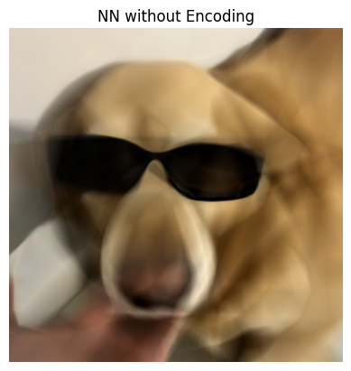
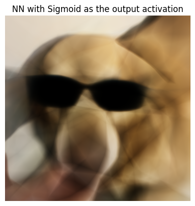
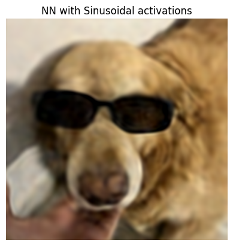
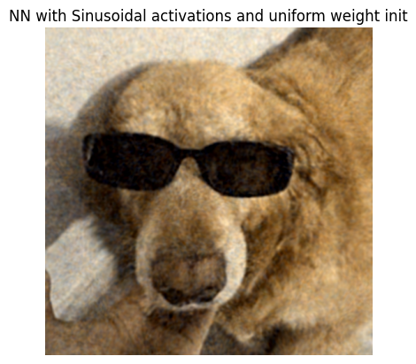
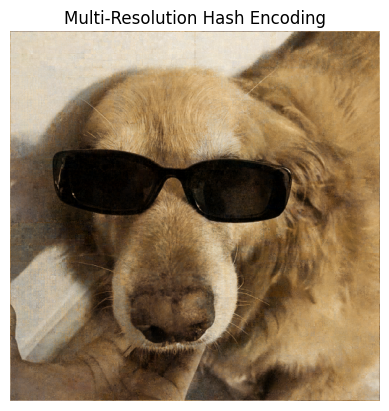

# Neural Fields with Input Encodings

    

        
    

    

        
    

    

        
    

    

        
    

    

        
    

    

        
    

    

        
    

 

I have extensively used Max Slater's <a href="https://thenumb.at/Neural-Graphics/#instant-neural-graphics-primitives">blog</a> to implement this.